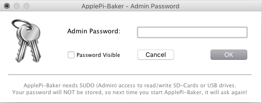
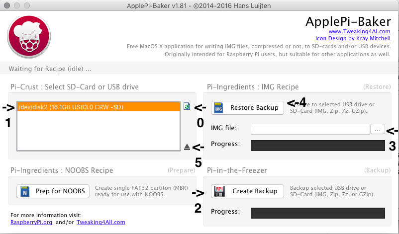

Archiver une image disque d'une carte micro sd raspberry pi


# version Graphique sous OSX

Télécharger et installer le logiciel [applePi baker](http://www.tweaking4all.com/hardware/raspberry-pi/macosx-apple-pi-baker/) (version 1.8.1 au temps de l'écriture)

Placer la carte microSd dans l'ordinateur (via l'adaptateur microSd vers SD ou via un lecteur microSd)

Lancer l'application ApplePi Baker

entrer votre mot de passe administrateur et appuyer sur OK





0) si vous ne voyez pas la ligne orange appuyer sur l'icône de rafraichissement indiqué (la couleur de la surbrillance,  la taille de la partition et le type de lecteur varient en fonction de votre configuration)

1) sélectionner la partition qui correspond au système raspberry pi à archiver

2) Appuyer sur Create backup
  * une fenêtre surgissante vous demandera où sauvegarder l'image disque,  pointer un endroit disposant de suffisamment d'espace (une carte de 8 gigaoctets prend 8 gigaoctets d'espace)
  * Cette fenêtre vous demandera quel type de compression vous voulez employer.  Le format sans compression fonctionne très bien et très rapidement, par contre il prend de la place

  * Suite à l'opération,  appuyer sur le bouton éjecteur (indiqué par le numéro 5)
3) Changer de carte micro SD (carte vierge de préférence),  cliquer sur les trois petits points indiqués par le numéro 3 et pointer vers l'image disque effectuée à l'étape 2

4) Appuyer sur Restore Backup (4) et attendre

5) éjecter la carte et insérer dans le raspberry pi cible

# configuration du raspberry après Backup


### changer l'adresse IP virtuelle
La carte que vous venez de copier contient exactement toutes les mêmes informations que celle d'origine.  Au point de vue pratique cela peut provoquer des conflits au niveau de la nomenclature réseau.  

Pour ce faire,  ne pas brancher les deux raspberrpi ayant potentiellement la même identité en même temps sur le réseau avant d'avoir adéquatement configuré le nouveau.

Opération à effectuer sur le nouveau raspberry

1) brancher le raspberry au réseau et à l'alimentation électrique.

2) accéder via SSH à ce raspberry-pi

3) configurer manuellement l'adresse virtuelle en lançant la commande suivante.  L'éditeur texte s'appelle Nano,  il est plus simple que vim,  la souris ne fonctionne pas,  il faut naviguer avec les flèches.


```
sudo nano /etc/network/interfaces
```

Dans le ficher ,vous devriez voir les lignes suivantes

```
auto eth0:1
iface eth0:1 inet static
address 10.0.0.101
netmask 255.255.255.0
```

Dans ce cas,  changer le 101 pour la nouvelle identité du raspberry-pi en préservant le plus possible l'allocation continue des adresses .  Par exemple si le dernier qui a été identifié est le numéro 9,  le prochain est le numéro 10 et son adresse IP devrait être 110.  

Une fois l'opération effectuée,  sauvegarder le fichier en appuyant sur ctrl+x ,  un dialogue surgire,  appuyer sur y pour sauvegarder.


### Changer le «hostname» du raspberry-pi

Dans la fenêtre SSH

entrer la commande suivante :

```
sudo raspi-config
```

Naviguer avec les fleches jusqu'à «advances options»


Choisir  “Hostname”.

Lire et appuyer sur “OK”.

Écrire le nom désiré (en préservant la logique de nomenclature)

Appuyer sur OK


Sélectionner “Finish”.

On vous demandera de redémarrer sélectionner “Yes”.

Votre pi devrait redémarrer avec le bon nom et la bonne adresse.
